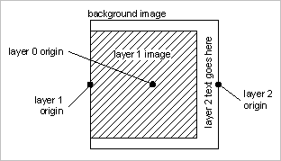

# Exempel A{#example-a}

Skapa en mall med fast storlek med en statisk bakgrundsbild, en variabel bild som är justerad mot bakgrunden i mitten till vänster och skalad till högst 80 % av bakgrunden och ett textlager med lodrät text centrerad i den högra kanten av arbetsytan.

## Mallposten {#section-32f54710593e438fa0622224c89380af}

Infoga objekt

<table id="simpletable_97ECA49445634F59B3F1D100412EFC70"> 
 <tr class="strow"> 
  <td class="stentry"> 
  katalog::ID  
 </td> 
  <td class="stentry"> 
  myTemplate1  
 </td> 
 </tr> 
 <tr class="strow"> 
  <td class="stentry"> 
  katalog::Modifier  
 </td> 
  <td class="stentry"> 
  src=backgroundImage&amp;size=1000,1000&amp;originN=0,0&amp; layer=1&amp;src=$object$&amp;size=800,800&amp;originN=-0.5,0&amp;posN=-0.5,0&amp; layer=2&amp;$text=layer+2+text+goes+here text=rtf..$text$...rtf-encoding&amp;rotate=-90&amp;originN=0.5,0&amp;posN=0.5,0  
 </td> 
 </tr> 
</table>

Värdena `origin=` för alla lager anges explicit i mallen för att strikt styra placering och justering av lagren. Varje lagers ursprung ställs in så att det matchar den önskade justeringen för det lagret. Bakgrunden (lager 0) `origin=` ställs in på mitten. detta är godtyckligt eftersom bakgrundsbilden inte ändras vid körning, ett värde för origo för lager 0 kan användas.

Värdena `pos=` ger de förskjutningar mellan lagerstartpunkterna som behövs för att uppnå önskad lagerplacering.

Fästpunkten för bild 1 i lager 1 placeras i mitten till vänster. tillsammans med `pos=` värdet uppnår detta vänstercentrerad justering mellan bakgrunden och bilden i lager 1, oavsett proportionerna för bilden i lager 1.

På samma sätt är ankarpunkten för textlagret placerad till höger i mitten av textrutan med automatisk storlek. I kombination med pos= uppnås den önskade högercentrerade justeringen för den roterade texten, oberoende av teckensnittsstorlek och stränglängd.

Den faktiska visningstexten kommer att anges vid körning, så en variabel används för att separera texten från rtf-formateringsomslaget. Vi använder standardvariabeln `$object` för bilden i lager 1. Detta gör att du kan ange den här bilden i sökvägen för begäran.

Alla bilder kan användas för bakgrundsbilden och bilden av lager 1. Om bakgrundsbilden har en mask fylls de omaskerade områdena med standardbakgrundsfärgen ( `attribute::BkgColor`), eller blir genomskinliga när `fmt=png-alpha` eller `fmt=tif-alpha`. Om bakgrundsbilden har en icke-fyrkantig proportion centreras den i svarsbilden och det extra utrymmet fylls med `attribute::BkgColor`. Om bilden i lager 1 har alfavärden eller en mask förblir bakgrundsbilden (eller bakgrundsfärgen) synlig i de genomskinliga områdena. Om bilden inte har någon mask fyller den hela den tilldelade rektangeln.

## Använda mallen {#section-3e04eedc268c482db5a8cfc662c0f327}

` http:// *`server`*/myRootId/anotherImage?template=myTemplate1&$text=about+the+image`

Följande bild visar det sammansatta resultatet för olika bildproportioner i bilden i lager 1 och olika textsträngar.

