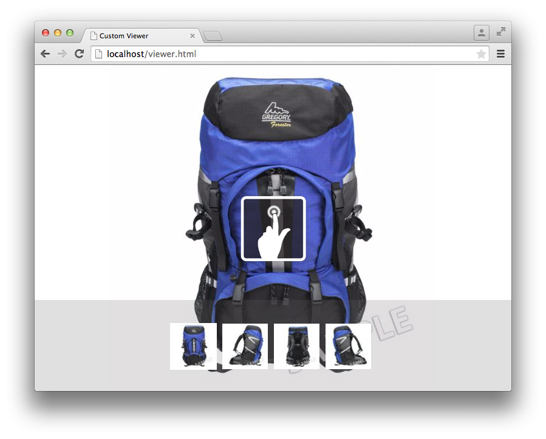

# Självstudiekurs om SDK för visningsprogram{#viewer-sdk-tutorial}

Viewer SDK innehåller en uppsättning JavaScript-baserade komponenter för anpassad visningsprogramutveckling. Tittarna är webbaserade program som gör att multimediematerial från Adobe Scene7 kan bäddas in på webbsidor.

SDK innehåller till exempel interaktiv zoomning och panorering. Den ger även 360-gradersvisning och videouppspelning av resurser som överförts till Adobe Scene7 via serverdelsprogrammet SPS (Scene7 Publishing System).

Även om komponenterna är beroende av HTML5-funktioner är de utformade för att fungera på Android- och Apple iOS-enheter och stationära datorer, inklusive Internet Explorer och senare. Den här typen av upplevelser innebär att du kan skapa ett enda arbetsflöde för alla plattformar som stöds.

SDK består av UI-komponenter som utgör visningsprograminnehåll. Du kan formatera de här komponenterna med CSS och andra komponenter än användargränssnittskomponenter som har någon stödroll, som hämtning, tolkning och spårning av uppsättningar. Alla komponentbeteenden kan anpassas med modifieringar som du kan ange på flera olika sätt, till exempel som `name=value` par i URL:en.

Den här självstudiekursen innehåller följande åtgärder som du kan använda för att skapa ett enkelt zoomningsvisningsprogram:

* [Hämta den senaste SDK-versionen av visningsprogrammet från Adobe Developer Connection](c-tutorial.md#section-84dc74c9d8e24a2380b6cf8fc28d7127)
* [Läs in SDK för visningsprogrammet](c-tutorial.md#section-98596c276faf4cf79ccf558a9f4432c6)
* [Lägga till format i visningsprogrammet](c-tutorial.md#section-3783125360a1425eae5a5a334867cc32)
* [Inklusive Container och ZoomView](c-tutorial.md#section-1a01730663154a508b88cc40c6f35539)
* [Lägga till MediaSet- och Swatches-komponenter i visningsprogrammet](c-tutorial.md#section-02b8c21dd842400e83eae2a48ec265b7)
* [Lägga till knappar i visningsprogrammet](c-tutorial.md#section-1fc334fa0d2b47eb9cdad461725c07be)
* [Konfigurera färgrutorna lodrätt](c-tutorial.md#section-91a8829d5b5a4d45a35b7faeb097fcc9)

## Hämta den senaste SDK-versionen av visningsprogrammet från Adobe Developer Connection {#section-84dc74c9d8e24a2380b6cf8fc28d7127}

1. Hämta den senaste SDK:n för visningsprogram från Adobe Developer Connection [här](https://marketing.adobe.com/developer/devcenter/scene7/show).

   >[!NOTE]
   >
   >Du kan slutföra den här självstudiekursen utan att behöva ladda ned SDK-paketet för visningsprogrammet eftersom SDK faktiskt läses in via fjärranslutning. Viewer-paketet innehåller dock ytterligare exempel och en API-referenshandbok som du kan använda när du skapar egna visningsprogram.

## Läs in SDK för visningsprogrammet {#section-98596c276faf4cf79ccf558a9f4432c6}

1. Börja med att konfigurera en ny sida för att utveckla det grundläggande zoomvisningsprogrammet som du ska skapa.

   Överväg att göra detta med bootstrap-koden, eller loader-koden, för att konfigurera ett tomt SDK-program. Öppna din favorittextredigerare och klistra in följande HTML-kod i den:

   ```
   <!DOCTYPE html> 
   <html> 
       <head> 
           <meta http-equiv="Content-Type" content="text/html; charset=utf-8" /> 
           <meta name="viewport" content="user-scalable=no, height=device-height, width=device-width, initial-scale=1.0, maximum-scale=1.0"/> 
   
           <!-- Hiding the Safari on iPhone OS UI components --> 
           <meta name="apple-mobile-web-app-capable" content="yes"/> 
           <meta name="apple-mobile-web-app-status-bar-style" content="black"/> 
           <meta name="apple-touch-fullscreen" content="no"/> 
   
           <title>Custom Viewer</title> 
   
           <!-- 
               Include Utils.js before you use any of the SDK components. This file  
               contains SDK utilities and global functions that are used to initialize the viewer and load viewer  
               components. The path to the Utils.js determines which version of the SDK that the viewer uses. You  
               can use a relative path if the viewer is deployed on one of the Adobe Scene7 servers and it is served  
               from the same domain. Otherwise, specify a full path to one of Adobe Scene7 servers that have the SDK  
               installed.  
           --> 
           <script language="javascript" type="text/javascript"      
                   src="http://s7d1.scene7.com/s7sdk/2.8/js/s7sdk/utils/Utils.js"></script> 
   
       </head> 
       <body> 
           <script language="javascript" type="text/javascript"> 
           </script>  
       </body> 
   </html>
   ```

   Lägg till följande JavaScript-kod i - `script` taggen för att initiera `ParameterManager`. Detta hjälper dig att förbereda för att skapa och instansiera SDK-komponenter i `initViewer` funktionen:

   ```
   /* We create a self-running anonymous function to encapsulate variable scope. Placing code inside such 
      a function is optional, but this prevents variables from polluting the global object.  */ 
   (function () { 
   
       // Initialize the SDK   
       s7sdk.Util.init(); 
   
       /* Create an instance of the ParameterManager component to collect components' configuration 
          that can come from a viewer preset, URL, or the HTML page itself. The ParameterManager  
          component also sends a notification s7sdk.Event.SDK_READY when all needed files are loaded 
          and the configuration parameters are processed. The other components should never be initialized 
          outside this handler. After defining the handler for the s7sdk.Event.SDK_READY event, it 
          is safe to initiate configuration initialization by calling ParameterManager.init(). */ 
       var params = new s7sdk.ParameterManager(); 
   
       /* Event handler for s7sdk.Event.SDK_READY dispatched by ParameterManager to initialize various components of  
          this viewer. */ 
       function initViewer() { 
   
       }  
   
       /* Add event handler for the s7sdk.Event.SDK_READY event dispatched by the ParameterManager when all modifiers 
          are processed and it is safe to initialize the viewer. */ 
       params.addEventListener(s7sdk.Event.SDK_READY, initViewer, false); 
   
       /* Initiate configuration initialization of ParameterManager. */ 
       params.init(); 
   
   }());
   ```

1. Spara filen som en tom mall. Du kan använda vilket filnamn du vill.

   Du kommer att använda den här tomma mallfilen som referens när du skapar nya visningsprogram i framtiden. Den här mallen fungerar lokalt och när den används från en webbserver.

Du kommer nu att lägga till format i visningsprogrammet.

## Lägga till format i visningsprogrammet {#section-3783125360a1425eae5a5a334867cc32}

1. Du kan lägga till några grundläggande format för det här helsidesvisningsprogrammet som du skapar.

   Lägg till följande `style` block längst ned i `head`:

   ```
   <style> 
       html, body { 
           width: 100%; 
           height: 100%; 
       } 
       body { 
           /* Remove any padding and margin around the edges of the browser window */ 
           padding: 0; 
           margin: 0; 
   
           /* We set overflow to hidden so that scroll bars do not flicker when resizing the window */ 
           overflow: hidden; 
       } 
   </style>
   ```

Du kommer nu att inkludera komponenterna `Container` och `ZoomView`.

## Inklusive Container och ZoomView {#section-1a01730663154a508b88cc40c6f35539}

1. Skapa ett faktiskt visningsprogram genom att inkludera komponenterna `Container` och `ZoomView`.

   Infoga följande `include` satser längst ned i `<head>` elementet - efter att [!DNL Utils.js] skriptet har lästs in:

   ```
   <!-- 
       Add an "include" statement with a related module for each component that is needed for that particular  
       viewer. Check API documentation to see a complete list of components and their modules. 
   --> 
   <script language="javascript" type="text/javascript"> 
       s7sdk.Util.lib.include('s7sdk.common.Container');  
       s7sdk.Util.lib.include('s7sdk.image.ZoomView');  
   </script>
   ```

1. Skapa nu variabler för att referera till de olika SDK-komponenterna.

   Lägg till följande variabler högst upp i den anonyma huvudfunktionen, alldeles ovanför `s7sdk.Util.init()`:

   ```
   var container, zoomView;
   ```

1. Infoga följande inuti `initViewer` funktionen för att definiera vissa modifierare och instansiera respektive komponenter:

   ```
   /* Modifiers can be added directly to ParameterManager instance */ 
   params.push("serverurl", "http://s7d1.scene7.com/is/image"); 
   params.push("asset", "Scene7SharedAssets/ImageSet-Views-Sample"); 
   
   /* Create a viewer container as a parent component for other user interface components that  
      are part of the viewer application and associate event handlers for resize and  
      full screen notification. The advantage of using Container as the parent is the  
      component's ability to resize and bring itself and its children to full screen. */ 
   container = new s7sdk.common.Container(null, params, "s7container"); 
   container.addEventListener(s7sdk.event.ResizeEvent.COMPONENT_RESIZE, containerResize, false); 
   
   /* Create ZoomView component */ 
   zoomView = new s7sdk.image.ZoomView("s7container", params, "myZoomView");  
   
   /* We call this to ensure all SDK components are scaled to initial conditions when viewer loads */ 
   resizeViewer(container.getWidth(), container.getHeight());
   ```

1. För att ovanstående kod ska fungera korrekt lägger du till en `containerResize` händelsehanterare och en hjälpfunktion:

   ```
   /* Event handler for s7sdk.event.ResizeEvent.COMPONENT_RESIZE events dispatched by Container to resize 
      various view components included in this viewer. */ 
   function containerResize(event) { 
       resizeViewer(event.s7event.w, event.s7event.h); 
   } 
   
   /* Resize viewer components */ 
   function resizeViewer(width, height) { 
       zoomView.resize(width, height); 
   }
   ```

1. Förhandsgranska sidan så att du ser vad du har skapat. Sidan ser ut så här:

   

Nu ska du lägga till komponenterna `MediaSet` och `Swatches` till visningsprogrammet.

## Lägga till MediaSet- och Swatches-komponenter i visningsprogrammet {#section-02b8c21dd842400e83eae2a48ec265b7}

1. Om du vill att användarna ska kunna välja bilder från en uppsättning kan du lägga till komponenterna `MediaSet` och `Swatches`.

   Lägg till följande SDK:

   ```
   s7sdk.Util.lib.include('s7sdk.set.MediaSet'); 
   s7sdk.Util.lib.include('s7sdk.set.Swatches');
   ```

1. Uppdatera variabellistan med följande:

   ```
   var mediaSet, container, zoomView, swatches;
   ```

1. Skapa instanser `MediaSet` och `Swatches` komponenter inuti `initViewer` funktionen.

   Se till att instansiera `Swatches` instansen efter `ZoomView` och `Container` komponenterna, annars döljs följande i staplingsordningen `Swatches`:

   ```
   // Create MediaSet to manage assets and add event listener to the NOTF_SET_PARSED event 
   mediaSet = new s7sdk.set.MediaSet(null, params, "mediaSet"); 
   
   // Add MediaSet event listener 
   mediaSet.addEventListener(s7sdk.event.AssetEvent.NOTF_SET_PARSED, onSetParsed, false); 
   
   /* create Swatches component and associate event handler for swatch selection notification */ 
   swatches = new s7sdk.set.Swatches("s7container", params, "mySwatches");   
   swatches.addEventListener(s7sdk.event.AssetEvent.SWATCH_SELECTED_EVENT, swatchSelected, false);
   ```

1. Lägg nu till följande händelsehanterarfunktioner:

   ```
   /* Event handler for the s7sdk.event.AssetEvent.NOTF_SET_PARSED event dispatched by MediaSet to 
      assign the asset to the Swatches when parsing is complete. */ 
   function onSetParsed(e) { 
   
       // set media set for Swatches to display  
       var mediasetDesc = e.s7event.asset;  
       swatches.setMediaSet(mediasetDesc); 
   
       // select the first swatch by default  
       swatches.selectSwatch(0, true);      
   } 
   
   /* Event handler for s7sdk.event.AssetEvent.SWATCH_SELECTED_EVENT events dispatched by Swatches to switch 
      the image in the ZoomView when a different swatch is selected. */ 
   function swatchSelected(event) {     
       zoomView.setItem(event.s7event.asset);  
   }
   ```

1. Placera färgrutorna längst ned i visningsprogrammet genom att lägga till följande CSS till `style` elementet:

   ```
   /* Align swatches to bottom of viewer */ 
   .s7swatches { 
       bottom: 0; 
       left: 0; 
       right: 0; 
       height: 150px; 
   }
   ```

1. Förhandsgranska ditt visningsprogram.

   Observera att färgrutorna finns i det nedre vänstra hörnet i visningsprogrammet. Om du vill att färgrutorna ska ha hela visningsprogrammets bredd lägger du till ett anrop om att manuellt ändra storlek på färgrutorna när användaren ändrar storlek på webbläsaren. Lägg till följande i `resizeViewer` funktionen:

   ```
   swatches.resize(width, swatches.getHeight());
   ```

   Visningsprogrammet ser nu ut som följande bild. Prova att ändra storlek på webbläsarfönstret i visningsprogrammet och observera det resulterande beteendet.

   

Nu ska du lägga till knapparna för inzoomning, utzoomning och zoomning i visningsprogrammet.

## Lägga till knappar i visningsprogrammet {#section-1fc334fa0d2b47eb9cdad461725c07be}

1. För närvarande kan användaren bara zooma med klicknings- eller pekgester. Lägg därför till några grundläggande zoomkontrollknappar i visningsprogrammet.

   Lägg till följande knappkomponenter:

   ```
   s7sdk.Util.lib.include('s7sdk.common.Button');
   ```

1. Uppdatera variabellistan med följande:

   ```
   var mediaSet, container, zoomView, swatches, zoomInButton, zoomOutButton, zoomResetButton;
   ```

1. Instansiera knappar längst ned i `initViewer` funktionen.

   Kom ihåg att ordningen är viktig, såvida du inte anger `z-index` i CSS:

   ```
   /* Create Zoom In, Zoom Out and Zoom Reset buttons */ 
   zoomInButton  = new s7sdk.common.ZoomInButton("s7container", params, "zoomInBtn"); 
   zoomOutButton = new s7sdk.common.ZoomOutButton("s7container", params, "zoomOutBtn"); 
   zoomResetButton = new s7sdk.common.ZoomResetButton("s7container", params, "zoomResetBtn"); 
   
   /* Add handlers for zoom in, zoom out and zoom reset buttons inline. */ 
   zoomInButton.addEventListener("click", function() { zoomView.zoomIn(); }); 
   zoomOutButton.addEventListener("click", function() { zoomView.zoomOut(); }); 
   zoomResetButton.addEventListener("click", function() { zoomView.zoomReset(); });
   ```

1. Definiera några grundläggande format för knapparna genom att lägga till följande i `style` blocket längst upp i filen:

   ```
   /* define styles common to all button components and their sub-classes */ 
   .s7button { 
       position:absolute; 
       width: 28px; 
       height: 28px; 
       z-index:100; 
   } 
   
   /* position individual buttons*/ 
   .s7zoominbutton  { 
       top: 50px; 
       left: 50px; 
    } 
   .s7zoomoutbutton  { 
       top: 50px; 
       left: 80px; 
    } 
   .s7zoomresetbutton  { 
       top: 50px; 
       left: 110px; 
    }
   ```

1. Förhandsgranska ditt visningsprogram. Det ser ut så här:

   

   Nu ska du konfigurera färgrutorna så att de justeras lodrätt till höger.

## Konfigurera färgrutorna lodrätt {#section-91a8829d5b5a4d45a35b7faeb097fcc9}

1. Du kan konfigurera modifierare direkt på `ParameterManager` instansen.

   Lägg till följande längst upp i `initViewer` funktionen för att konfigurera `Swatches` miniatyrlayouten som en rad:

   ```
   params.push("Swatches.tmblayout", "1,0");
   ```

1. Uppdatera följande resize-anrop inuti `resizeViewer`:

   ```
   swatches.resize(swatches.getWidth(), height);
   ```

1. Redigera följande `s7swatches` regel i `ZoomViewer.css`:

   ```
   .s7swatches { 
       top:0 ; 
       bottom: 0; 
       right: 0; 
       width: 150px; 
   }
   ```

1. Förhandsgranska ditt visningsprogram. Det ser ut så här:

   

   Ditt grundläggande zoomvisningsprogram är nu klart.

   Den här självstudiekursen handlar om grunderna i vad Scene7 Viewer SDK erbjuder. När du arbetar med SDK kan du använda de olika standardkomponenterna för att enkelt skapa och utforma innehållsrika visningsupplevelser för målgrupperna.

